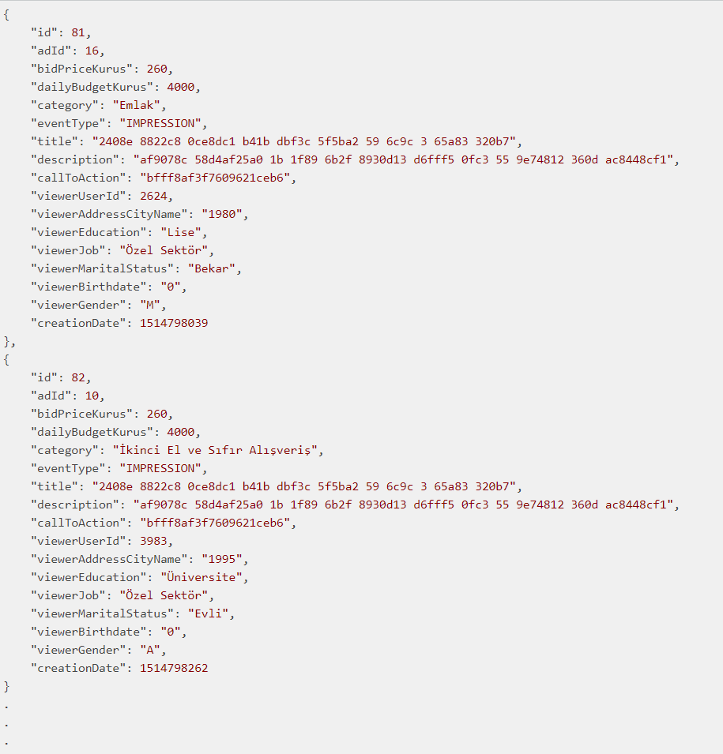
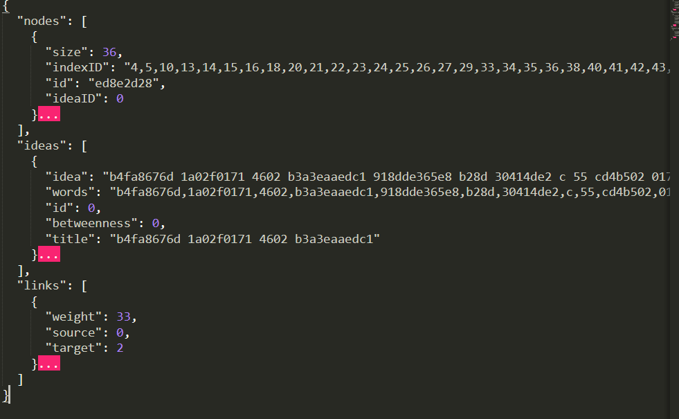
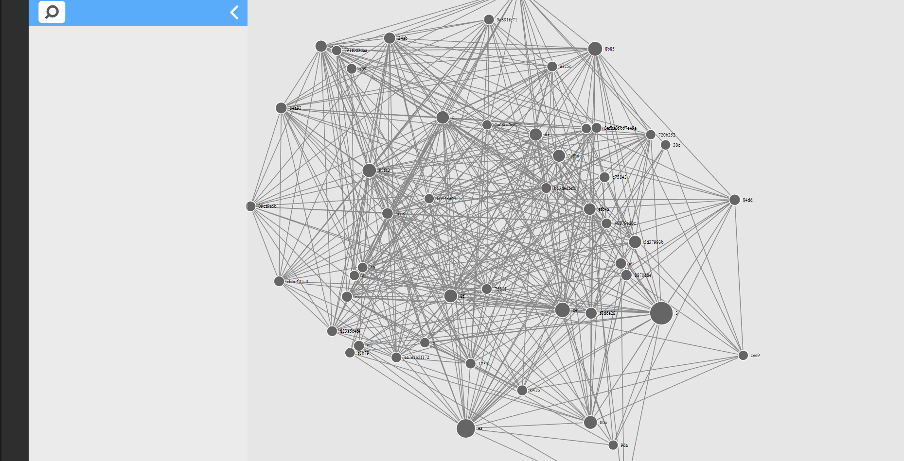
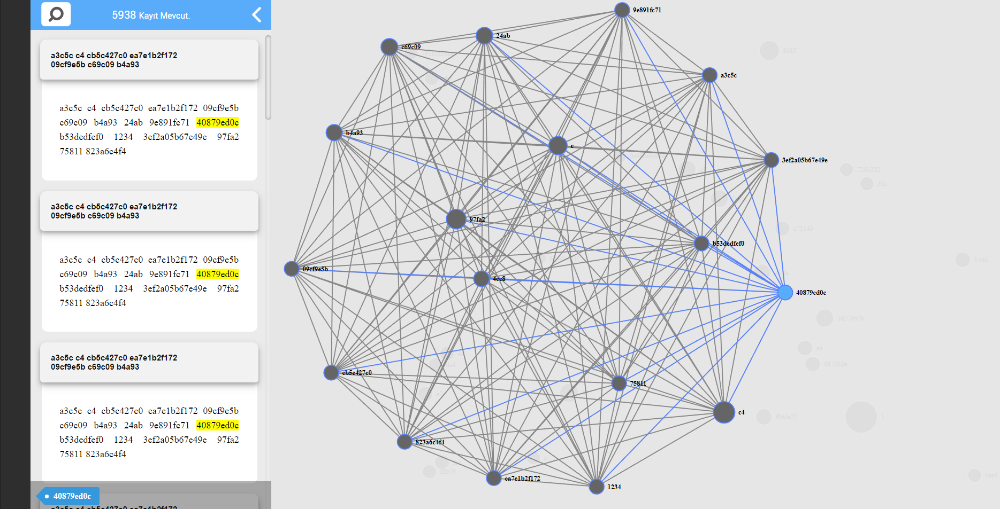
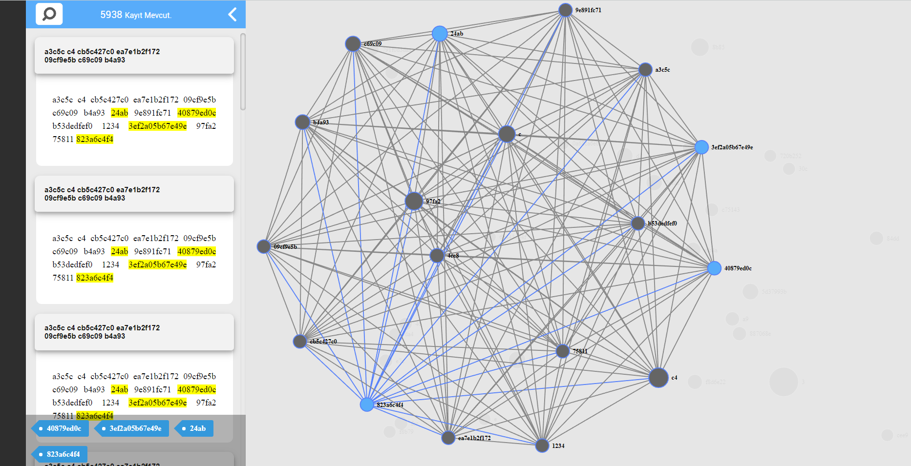

# Sahibinden.com #dev akademi

Elde ettiğim veriyi öncelikle inceledim. Neler yapabilirim diye baktım. İlk başta gösterme tıklama özerine bir analiz yapmayı düşündüm. Sonrasında farklı konular bulmak için arayışa giriştim:

  - Front end kısmında acaba reklam ekranın hangi kısmında daha tıklanabilir diye merak ettim. Örneğin sağ/sol/top bar mı? Yoksa ilanların arasında gizlenmiş bir şekilde bulunursa ilan görevi görür mü? Verinin yapısı gereği bu bilgiyi elde edemeyeceğim için yapamazdım.
  - Veri inceleme kısmında metin madenciliği ilan tıklamada etkili mi? Bu sorunun cevabını merak ettim. İşe koyuldum ve detaylı bilgiği aşağıda veriyor olacağım.
  - Arta kalan zaman olursa eğer kullanıcıların özelliklerine göre filtreleyebileceğim reklamlar listesi oluşturacaktım. Hangi özellikteki kullanıcılar hangi kelimelere odaklanıyor? Mesela evli erkeklerin istedikleri ev,araba veya herhangi bir ikinci el eşya var mı? Daha çok kaç odalı ev alıyorlar. Evli TÜRK erkeği gerçekten dobloya düşkün mü? :D
 

# Veri hazırlana işlemi 

Veriyi görselleştirebilmem için öncelikle belli bir formata sokmam gerekiyordu. Kullanacağım görselleştirme tekniği bubblechart veya network analysis olacaktı. Network analysis genellikte sosyal ağ analizlerinde kullanılıyor. Arkadaş olanlar veya birlikte zaman geçirenler gibi. Bende acaba birlikte kullanılan kelimeler reklama tıklamada etkili mi? Veya reklam başlığı tıklanmayı arttırmak için nasıl kurgulanmalı.
Network analysis için:

  - **Nodes** : Kelimeleri temsil ediyor. Corpus (derlem) içerisinde en çok kullanılan kelimelerin zaman karmaşıklığı yaratmaması açısından ilk 50 tanesi seçildi.
  - **İdeas** : Elimizdeki title ve description verileri birleştirilip tek bir metin haline getirildi ve kelimelerine ayrıştırılarak tutuldu.
  - **links** : Network üzerindeki her bir node kulanılan top100'da ki kelimeyi ifade ediyordu. Birbirleri arasındaki bağı ise aynı reklam metni içinde geçiyorsa bağlı geçmiyorsa bağlantısız şekilde ayarlandı.
  
>**Dip Not:** Elimizde hashlenmiş veri olduğundan sonuç konusunda şüpheliydim. Sonucu iyileştirmek için stopwords (Sık geçen veya değersiz kelimeler {ve,veya,bir,ile vb}) temizlenebilirdi). Birde otomobil ile otomobili farklı kelime olarak almış bulundum normalde bunlar tek bir kelimede **otomobil** de toplanmalıydı. Bu durum otomobilin değerini arttıracağından networkteki gücünüde arttıracaktı. Bağzı bağlar kopartılarakda network edge ve node ağırlıkları değiştirilebilir.
##### Graph.json içeriği

### Network Analysis

Veri görselleştirme kısmında **d3.js** kütüphanesini kullandım. Yönsüz etiketli grafı bu iş için idealdi. Daha önceden basit bir uygulama için çalışmıştım. Elimdeki datayı bu görselleştirmeye giydirdim. Solda bulunan alandan da tıklanılan kelimenin hangi reklam metinlerinde geçtiği yer almaktadır.

**Dip Not:** Verinin yoğunluğu yüzünden tıklandıktan sonra belli bir süre bekleme yaratıyor. O esnada o kelimenin temsil ettiği reklam metinlerini bulurken **Mark.js** kütüphanesi yardımıyla metin içinde kelimeyi partlatma işlemi yapmaktadır.

##### Network Analysis Görselleri 

>Diğer yapmak istediklerimi gerçekleştiremedim küçükten başlamış olsamda uyarılar üzerine yaptıklarımı güzel aktarmayı tercih ettim. Her şey için çook teşekkürler. Güzel bir etkinlikti :)
